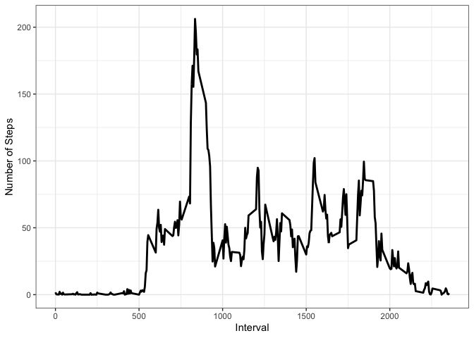

## Introduction

It is now possible to collect a large amount of data about personal
movement using activity monitoring devices such as a
[Fitbit](http://www.fitbit.com), [Nike
Fuelband](http://www.nike.com/us/en_us/c/nikeplus-fuelband), or
[Jawbone Up](https://jawbone.com/up). These type of devices are part of
the "quantified self" movement -- a group of enthusiasts who take
measurements about themselves regularly to improve their health, to
find patterns in their behavior, or because they are tech geeks. But
these data remain under-utilized both because the raw data are hard to
obtain and there is a lack of statistical methods and software for
processing and interpreting the data.

This assignment makes use of data from a personal activity monitoring
device. This device collects data at 5 minute intervals through out the
day. The data consists of two months of data from an anonymous
individual collected during the months of October and November, 2012
and include the number of steps taken in 5 minute intervals each day.

## Data

The data for this assignment can be downloaded from the course web
site:

The variables included in this dataset are:

- **steps**: Number of steps taking in a 5-minute interval (missing
    values are coded as `NA`)

- **date**: The date on which the measurement was taken in YYYY-MM-DD
    format

- **interval**: Identifier for the 5-minute interval in which
    measurement was taken
    
The dataset is stored in a comma-separated-value (CSV) file and there
are a total of 17,568 observations in this
dataset.

## Libraries


```r
library(dplyr)
library(ggplot2)
```

## Loading and preprocessing the data


```r
unzip("activity.zip")
activityData<- read.csv("activity.csv", header= TRUE, sep = ",", colClasses=c("numeric", "character", "numeric"))
activityData$date<- as.Date(activityData$date, format = "%Y-%m-%d")
str(activityData)
```

```
## 'data.frame':	17568 obs. of  3 variables:
##  $ steps   : num  NA NA NA NA NA NA NA NA NA NA ...
##  $ date    : Date, format: "2012-10-01" "2012-10-01" ...
##  $ interval: num  0 5 10 15 20 25 30 35 40 45 ...
```

## What is mean total number of steps taken per day?

#### Calculate the total number of steps taken per day  

```r
sumSteps<- activityData %>% 
           filter(!is.na(steps)) %>% 
           group_by(date) %>% 
           summarise(Sum_Steps = sum(steps))
head(sumSteps)
```

```
## # A tibble: 6 x 2
##   date       Sum_Steps
##   <date>         <dbl>
## 1 2012-10-02       126
## 2 2012-10-03     11352
## 3 2012-10-04     12116
## 4 2012-10-05     13294
## 5 2012-10-06     15420
## 6 2012-10-07     11015
```

#### Make a histogram of the total number of steps taken each day  

```r
sumSteps %>% ggplot(aes(x = Sum_Steps)) + 
             geom_histogram(fill = "#69b3a2",color="#e9ecef", alpha=0.9, binwidth = 1000) + 
             xlab("Total Number of Steps per day") +
             ylab("Number of Days (counts)") +
             ggtitle("Total Number of Steps per day vs Number of Days") + 
             theme_bw()
```

<!-- -->

#### Calculate and report the mean and median of the total number of steps taken per day


```r
steps_mean <- mean(sumSteps$Sum_Steps)
steps_median <- median(sumSteps$Sum_Steps)
```

The mean of the total number of steps taken per day is **10766.19** and median is **10765**

## What is the average daily activity pattern?

#### Aggregate intervals with the average number of steps taken, averaged across all days

```r
steps_per_interval <- activityData %>% 
                      filter(!is.na(steps)) %>% 
                      group_by(interval) %>% 
                      summarise(Mean_Steps = mean(steps))
str(steps_per_interval)
```

```
## Classes 'tbl_df', 'tbl' and 'data.frame':	288 obs. of  2 variables:
##  $ interval  : num  0 5 10 15 20 25 30 35 40 45 ...
##  $ Mean_Steps: num  1.717 0.3396 0.1321 0.1509 0.0755 ...
```


```r
steps_per_interval %>% ggplot(aes(x=interval, y=Mean_Steps)) +   
                       geom_line(color = "black",size=1) +  
                       xlab("Interval") +
                       ylab("Number of Steps") + 
                       theme_bw()
```

<!-- -->

#### 5-minute interval containing the maximum number of steps (averaged across all days)


```r
max_point<- steps_per_interval[which.max(steps_per_interval$Mean_Steps),]
```

The **835** interval has maximum **206** steps.

## Imputing missing values

#### Number of missing values in the dataset


```r
num_nas<-sum(!complete.cases(activityData))
```

The total number of rows with NAs is **2304**

#### Method for imputing missing step values

Missing step values were replaced by the mean number of steps taken for the corresponding time interval.


#### Create new dataset using imputed values 


```r
dataAgg<-aggregate(steps~interval,activityData,mean,na.rm=TRUE)
data_imputed<-merge(activityData,dataAgg,by=c("interval"))
data_imputed<-transform(data_imputed,steps.x = ifelse(is.na(steps.x),steps.y,steps.x))
data_imputed<-subset(data_imputed,select=-c(steps.y))
data_imputed<-data_imputed %>% rename(steps = steps.x)
data_imputed$steps <- round(data_imputed$steps, digits = 0)
data_imputed<-data_imputed[order(data_imputed$date, data_imputed$interval),]
summary(data_imputed)
```

```
##     interval          steps             date           
##  Min.   :   0.0   Min.   :  0.00   Min.   :2012-10-01  
##  1st Qu.: 588.8   1st Qu.:  0.00   1st Qu.:2012-10-16  
##  Median :1177.5   Median :  0.00   Median :2012-10-31  
##  Mean   :1177.5   Mean   : 37.38   Mean   :2012-10-31  
##  3rd Qu.:1766.2   3rd Qu.: 27.00   3rd Qu.:2012-11-15  
##  Max.   :2355.0   Max.   :806.00   Max.   :2012-11-30
```

#### Aggregate steps by date

```r
dataImputedAgg<-aggregate(steps~date, data_imputed, sum)
```

#### Make a histogram of the total number of steps taken each day


```r
ggplot(dataImputedAgg, aes(x = steps)) + 
       geom_histogram(fill = "#69b3a2",color="#e9ecef", alpha=0.9, binwidth = 1000) + 
       xlab("Total Number of Steps per day") +
       ylab("Number of Days (counts)") +
       theme_bw()
```

<!-- -->

#### Calculate and report the mean and median total number of steps taken per day  

```r
step_mean_imputed<-mean(dataImputedAgg$steps)
step_median_imputed<-median(dataImputedAgg$steps)
```

The imputed dataset has mean value **10765.64** and median **10762**  

#### Do these values differ from the estimates from the first part of the assignment?
 
Yes, these values do differ slightly.  

- Before filling the data
    1. Mean: **10766.19**  
    2. Median: **10765**  
- After filling the data 
    1. Mean: **10765.64**  
    2. Median: **10762**  

#### What is the impact of imputing missing data on the estimates of the total daily number of steps?  
As you can see from above, both mean value and median value has been slightly shifted. And accoring to both histogram, it seems that the impact of imputing missing values has increase our peak, but it's not affect negatively our predictions. 

## Are there differences in activity patterns between weekdays and weekends?

#### Create new variable (Weekday or Weekend) based on date

```r
data_imputed$dayType<- weekdays(data_imputed$date, abbr = TRUE)
data_imputed$dayType<- ifelse(data_imputed$dayType %in% c("Sun","Sat"), "Weekend","Weekday")
data_imputed$dayType<-factor(data_imputed$dayType, levels = c("Weekday","Weekend"))
```

#### Aggregate steps by interval and day type


```r
dataWeekAgg<-aggregate(steps~interval+dayType,data_imputed,mean)
```

#### Creates time series plot based on Weekday or Weekend

```r
dataWeekAgg %>% ggplot(aes(x = interval, y = steps)) +
                 geom_line()+
                 facet_wrap(~dayType, nrow=2, ncol=1) +
                 xlab("Interval") +
                 ylab("Number of Steps") +
                 theme_bw()
```

<!-- -->


As we can see from the graph above, ctivity on the weekday has the greatest peak from all steps intervals. Comparing to weekday, weekend's activities has more peaks over a hundred than weekday. 

This may be due to the fact that activities on weekdays mostly follow a work related routine. In the other hand, we can see better distribution of effort along the time over weekends.
